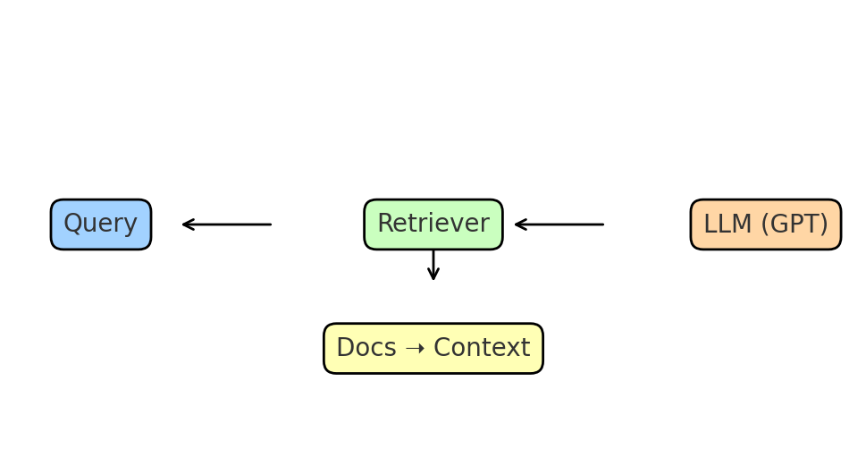

# 🧠 Minimal Retrieval-Augmented Generation (RAG) Example

[](https://www.python.org/) 
[](https://platform.openai.com/) 
[](LICENSE)

This repository is a **tiny, self-contained example of Retrieval-Augmented Generation (RAG)**.  
It shows how to **index → retrieve → generate** grounded answers with citations using only:
- **Python** (≈100 lines of code)  
- **OpenAI embeddings + chat models**  
- A **simple JSON vector store** (no database required)  

> 🎯 Ideal for learning, demos, or as a starting point for production RAG projects.

---

## 📚 What Is RAG?

**RAG = Search + Chat.**  
Instead of asking a language model to “know everything,” you:
1. **Retrieve** the most relevant chunks from your own documents.  
2. **Augment** the prompt with those chunks as context.  
3. **Generate** an answer grounded in real sources.  

This keeps responses **current, private, auditable**, and avoids retraining the model.

---

## 🖼️ How It Works



```
 ┌──────────┐      ┌─────────────┐      ┌──────────────┐
 │  Query   │ ──▶ │  Retriever   │ ──▶ │   LLM (GPT)  │
 └──────────┘      └─────────────┘      └──────────────┘
                      ▲        │
                      │        ▼
                  Document  Context
                   Chunks   + Prompt
```

---

## 🚀 Quickstart

### 1. Clone & Install
```bash
git clone https://github.com/yourusername/rag-intro-mini.git
cd rag-intro-mini
pip install -r requirements.txt
```

### 2. Set Your API Key
```bash
# Bash (Linux/Mac)
export OPENAI_API_KEY="sk-..."

# Windows PowerShell
setx OPENAI_API_KEY "sk-..."
```

### 3. Inspect the Docs
We ship with a tiny corpus you can edit:
- `data/what-is-rag.txt`
- `data/when-to-use-rag.txt`
- `data/grounding-tips.txt`

### 4. Build the Index
```bash
python rag_minimal.py --build
```
This creates `vector_store.json` with embeddings for your docs.

### 5. Ask Questions
```bash
python rag_minimal.py --ask "When should I use RAG instead of fine-tuning?"
python rag_minimal.py --ask "Give 3 tips to reduce hallucinations and cite sources."
```

✅ Example output:
```
Answer:
Use RAG when your knowledge changes frequently, is proprietary, or too large to fit into a prompt.

Sources:
• data/when-to-use-rag.txt
• data/what-is-rag.txt
```

---

## 🗂️ Repo Contents

- `rag_minimal.py` → core RAG pipeline (~100 lines)
- `data/*.txt` → small editable document corpus
- `vector_store.json` → generated embedding store
- `requirements.txt` → dependencies
- `README.md` → this tutorial

---

## 🌟 Why This Example Is Unique

- **Minimal**: No vector DB required — uses JSON + cosine similarity.  
- **Transparent**: Every step (embedding, retrieval, generation) is explicit.  
- **Customizable**: Swap in your own `.txt` files and re-index in seconds.  
- **Grounded**: Prompt enforces citations and “I don’t know” fallback.  

---

## 🔧 Extending This Example

Want to go further? Try:
- Chunking long docs into paragraphs.  
- Storing embeddings in **FAISS, Weaviate, Pinecone, or PostgreSQL**.  
- Using larger embedding models (e.g. `text-embedding-3-large`).  
- Adding UI with **Streamlit or React**.  

---

## 📚 Learn More

- [OpenAI RAG Guide](https://platform.openai.com/docs/guides/retrieval)  
- [LangChain RAG Concepts](https://python.langchain.com/docs/use_cases/question_answering/)  
- [Morton Technologies LLC](https://mortontech.ai) — custom software & AI experts  
- [RagDevelopment.com](https://ragdevelopment.com) — advanced RAG solutions for business  

---

## 👨‍💻 About

Created by **Morton Technologies LLC**, a software development company with 20+ years of experience in:
- **Custom PHP/JavaScript development**
- **AI/ML applications**
- **Cloud & IoT solutions**

For commercial RAG systems, integrations, or custom software, visit:  
👉 [Morton Technologies](https://mortontech.ai) | 👉 [RagDevelopment.com](https://ragdevelopment.com)

---

### ⭐ Support This Project
If you find this helpful:
- Star ⭐ this repo  
- Share with developers learning AI  
- Contribute improvements or examples  
